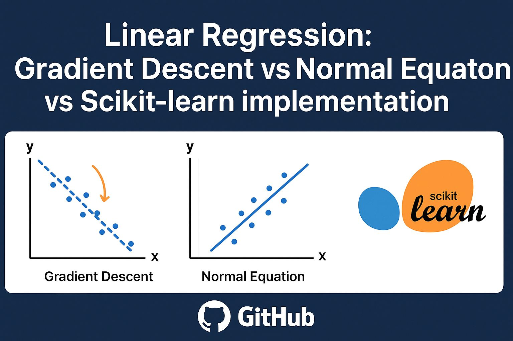

<p align="center">
  

# Linear Regression: Gradient Descent vs Normal Equation vs Scikit-learn Implementation

## 📌 Overview
This project demonstrates and compares three different approaches to implement **Linear Regression**:
- From scratch using **Gradient Descent**  
- From scratch using the **Normal Equation**  
- Using **Scikit-learn**  

The goal is to understand the trade-offs between each approach in terms of:
- Implementation complexity  
- Computational efficiency  
- Accuracy  

---

## 📂 Project Structure


---

## ⚙️ Installation
Clone the repository:
```bash
git clone https://github.com/Omarhamdyi/ml-algorithms-from-scratch.git
cd ml-algorithms-from-scratch/linear-regression-comparison

📊 Results

Comparison between the three methods in terms of training time and accuracy:

<p align="center">  </p>
