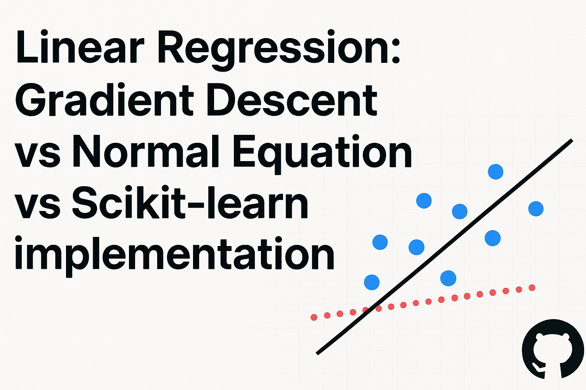
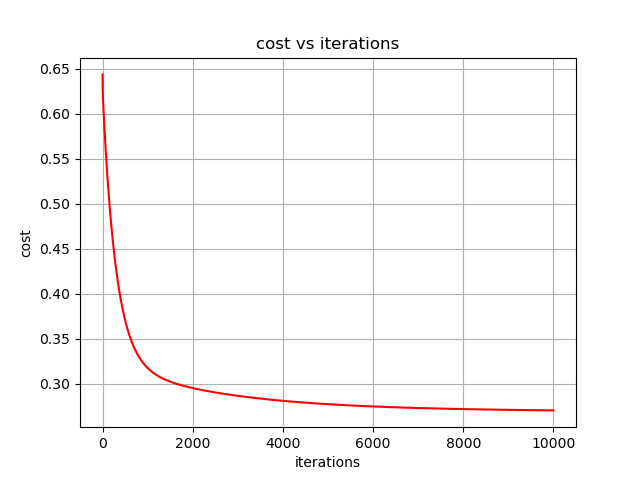

# Linear Regression: Gradient Descent vs Normal Equation vs Scikit-learn 

  

## 📑 Table of Contents
- [Overview](#-overview)
- [Dataset](#-dataset)
- [Project Structure](#-project-structure)
- [Required Packages](#-required-packages)
- [Implemented Methods](#-implemented-methods)
  - [Gradient Descent](#1-gradient-descent)
  - [Normal Equation](#2-normal-equation)
  - [Scikit-learn](#3-scikit-learn-implementation)
- [Results](#-results)
- [Visualization](#-visualization)
- [Time Complexity Analysis](#-time-complexity-analysis)
- [Key Takeaways](#-key-takeaways)
- [Future Work](#-future-work)

## 📌 Overview
This project implements and compares *three approaches* to Linear Regression:
1. *Gradient Descent implementation (from scratch)*
2. *Normal Equation implementation*
3. *Scikit-learn implementation*

The goal is to understand the differences between these methods in terms of:
- Implementation complexity
- Computation (time & resources)
- Accuracy (Mean Squared Error & R2)

---
## 📊 Dataset
i used the **California Housing dataset**, which contains features such as median income, average rooms, and location information, with the target being median house value.  

    from sklearn.datasets import fetch_california_housin
    housing = fetch_california_housing()
    X = housing.data        # feature matrix size (20640, 8)
    t = housing.target      # target vector size  (20640,)

---

## 📂 Project Structure
    Data/
    ├── load_data.py     # load data and scale it 
    
    src/
    ├── gradient_descent.py     # Linear Regression using Gradient Descent  
    ├── main.py                 # Calls all implementations & stores results
    ├── normal_equation.py      # Linear Regression using Normal Equation  
    ├── scikit_imp.py           # Linear Regression using scikit-learn  
    └── visualization.py        # Plots results for comparison
---

## 📦 Required Packages 
- **numpy** – numerical computations → `pip install numpy`  
- **pandas** – data manipulation and analysis → `pip install pandas`  
- **matplotlib** – plotting → `pip install matplotlib`  
- **scikit-learn** – machine learning tools (we will use: `mean_squared_error`, `MinMaxScaler`, `StandardScaler`) → `pip install scikit-learn` 
---

## 🧮 Implemented Methods

### 1. Gradient Descent

Gradient descent is a **general iterative optimization algorithm** for finding the **minimum of a differentiable function**. At each step, the parameters are updated by moving in the opposite direction of the gradient.  
It can be applied to any differentiable function where the goal is to find its minimum.

  
  
where α is the learning rate (hyperparameter).

For **linear regression**, the objective function to minimize is the **mean squared error (MSE)**:

  
  
Since the cost function depends on more than one parameter (\(w\) and \(b\)), we compute **partial derivatives** with respect to each parameter:

  

These derivatives show how changes in each parameter affect the cost. Plugging them into the gradient descent rule gives the update equations for \(w\) and \(b\).  

**Key points:**
- Works well with large datasets  
- Requires choosing a learning rate (α) and number of iterations  
- May take time to converge  

---

### 2. Normal Equation
A *closed-form solution* for Linear Regression that directly computes the weights without iteration.

  
  
    
> **θ**: Hypothesis parameters that define the model.  
> **X**: Input feature value of each instance.  
> **Y**: Output value of each instance.

**Key points:**
- No need to choose learning rate or iterations  
- Works well for small to medium datasets  
- Becomes computationally expensive when the number of features is huge (matrix inversion)  

---

### 3. Scikit-learn Implementation
Uses the **LinearRegression** class from Scikit-learn.  
Internally, it applies *Ordinary Least Squares (OLS)*, which is mathematically equivalent to the **Normal Equation**, but implemented in an optimized way.

**Key differences from Normal Equation:**
- Handles numerical stability issues better  
- Efficient for large datasets due to optimized linear algebra libraries  
- Provides additional features (like regularization in Ridge/Lasso)  

**python**

    from sklearn.linear_model import LinearRegression
    model = LinearRegression()
    model.fit(X, y)

---

## 📊 Results 
- *Comparison Table* (example):

| Method            | MSE                 | R²                 | Weights                                                                 | Notes                   |
|-------------------|---------------------|--------------------|-------------------------------------------------------------------------|--------------------------|
| Gradient Descent  | 0.27042315429105385 | 0.5938220970331505 | [ 3.46904075  5.608185    0.58193581  0.51505836  0.97072581  0.48714267 0.07316374 -3.65842993 -3.94199966] | Iterative approach       |
| Normal Equation   | 0.2621604930923035  | 0.6062326851998051 | [3.72961166, 6.33214009, 0.48122468, -15.13916237, 21.76021606, -0.1418736, -4.70531325, -3.96456829, -4.3625181] | Direct closed-form sol.  |
| Scikit-learn      | 0.26216049309230355 | 0.6062326851998051 | [3.72961166, 6.33214009, 0.48122468, -15.13916237, 21.76021606, -0.1418736, -4.70531325, -3.96456829, -4.3625181] | Optimized library impl.  |

> **Note:** The results of **Normal Equation** and **Scikit-learn** are identical (same weights, MSE, and R²). 
---

## 📊 Visualization
  **Cost vs Iterations**
  The following graph shows how the **cost function decreases** over iterations during Gradient Descent.  
  - A smooth downward curve indicates the algorithm is converging properly.  
  - If the curve flattens out, the model has nearly converged.  
  - Sudden increases or oscillations usually mean the learning rate is too high. 
  

  

---

## ⏱ Time Complexity Analysis

### 1. Gradient Descent
- Each iteration requires computing the gradient:
  \[
  O(m \cdot n)
  \]
  where:
  - \(m\) = number of training examples  
  - \(n\) = number of features  
- If we run for \(k\) iterations:
  \[
  O(k \cdot m \cdot n)
  \]
- *Scalable* for large \(n\) (features), but sensitive to choice of learning rate and number of iterations.

---

### 2. Normal Equation
- Requires computing:
  - \(X^T X\): \(O(m \cdot n^2)\)  
  - Inverting \((X^T X))\): \(O(n^3)\)  
- Total complexity:
  \[
  O(m \cdot n^2 + n^3)
  \]
- Efficient for *small to medium feature size (n)*, but becomes very slow if \(n\) is very large.

---

### 3. Scikit-learn Implementation
- Internally uses optimized *linear algebra solvers* (like LAPACK).  
- Complexity is mathematically similar to the *Normal Equation*:
  \[
  O(m \cdot n^2 + n^3)
  \]
- But due to optimized libraries, it is usually *faster and more stable* in practice.  
- Can handle larger datasets better than a manual Normal Equation implementation.

---

### 📊 Complexity Comparison Table

| Method            | Time Complexity            | Suitable for             |
|-------------------|----------------------------|--------------------------|
| Gradient Descent  | \(O(k \cdot m \cdot n)\)   | Large features (n) and datasets where iterative optimization is preferred |
| Normal Equation   | \(O(m \cdot n^2 + n^3)\)   | Small/medium datasets with fewer features |
| Scikit-learn      | \(O(m \cdot n^2 + n^3)\)   | Practical large datasets, optimized computation |

---

## 🎯 Key Takeaways
- *Gradient Descent*: scalable but slower to converge.  
- *Normal Equation*: simple but not efficient for large datasets.  
- *Scikit-learn*: best for practical use, highly optimized.  

---

## 📌 Future Work
- Try different datasets  
- Add Regularization (Ridge, Lasso)  
- Extend comparison to Polynomial Regression  

---
